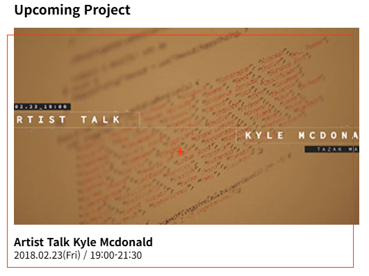
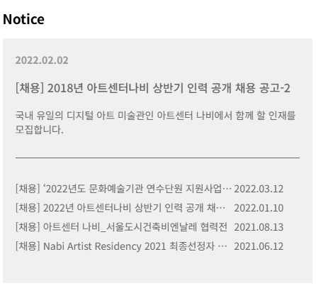

# ArtCenter Nabi

> 동적인 Swiper 효과와 하단 게시판 기능을 활용해 이벤트 정보를 직관적으로 제공하고 지속적인 방문을 유도하는 Web을 만들었습니다.

2024.08 ~

## Overview ⭐️

✅ 동적인 스와이퍼 효과를 메인 페이지에 적용   
✅ 전시회와 이벤트 정보를 한눈에 제공하고 사용자 참여를 유도   
✅ 하단 부에는 게시판 기능을 추가   
✅ 이로인한 방문자들의 지속적인 사이트 방문 유도를 구성   
✅ 리액트를 사용하여 지속 가능한 데이터 관리와 콘텐츠 유지 보수의 편의성을 크게 향상   

## 사용 기술 스택 🔧

- **Frontend** : React, GSAP, HTML, CSS
- **Backend** : Node.js
- **Database** : ** MongoDB **
- **Library** : SwiperJS
- **SCM** : Git, GitHub
- **Deployment** : Vercel
- **Design** : Figma
- **Platform**: Web

    
## 주요 기능 ⚙️

### [메인 화면]

|Main Slide|
|:---:|
||
|기본적인 swiperJS를 응용하여 메인화면을 구성해보았다.|   

- 메인 페이지에 동적인 Swiper를 적용하여 보다 Interective Web을 보여주고자 했습니다.
- 슬라이드 방식의 전시회 소개는 메인 페이지에서 전시회에 대한 정보를 한눈에 볼 수 있게 합니다.
- 추가 이벤트가 생길 시에는 간단한 업데이트로 지속적인 사이트 관리의 편의성을 높여줍니다.

### [탭에 호버 기능 구현]

|Hover|
|:---:|
||
|탭 - 호버 |  

- 사용자가 클릭 없이도 소개에 대한 정보를 얻을 수 있게  탭에 호버 기능을 구현 했습니다.
- 이 기능은 사이트 방문자들이 전시회를 더 쉽게 탐색하고 빠른 정보를 얻을 수 있도록 도와주는 역할을 합니다.
- 디자인 적으로는 부드러운 애니메이션 효과를 통해 전반적인 디자인 감을 높여주었습니다.

### [Video]

- video API를 활용하여 관련 기능을 구현하였습니다.

### [게시판]

|Board list|
|:---:|
||
|table로 게시판을 만들어 보았다. td,tr등등 기본적요소를 활용했다.|

- 게시판 기능을 추가하여 사용자가 전시회 관련 정보나 의견을 자유롭게 나눌 수 있는 공간을 제공 하였습니다.
- css선택자를 사용하여 폼 디자인,콘텐츠의 유지 보수나 교체를 도와주었습니다.
- Node.js와 Express를 사용하여 게시판 기능을 구현하였고 게시글 목록 조회, 작성, 수정, 삭제 기능을 제공 하였습니다.
- React와 axios를 활용해 프론트엔드에서 서버와 통신하여 동적인 게시판을 구현하였습니다.

## 후기 ⌨️

이번 미술관 사이트 리뉴얼 프로젝트는 웹에 대한 기초를 다질 수 있는 좋은 기회였습니다.

다양한 레이아웃과 애니메이션 효과를 적용하면서 CSS에 대한 이해도가 생겼고, 특히 동적인 웹 요소 구현 능력을 키웠습니다.

**서버와 데이터 연동을 이후에 추가하여 보완할 예정입니다.**

다음 프로젝트때는 백엔드 부분을 보완 해서 웹 구축하는것을 목표로 하겠습니다.
